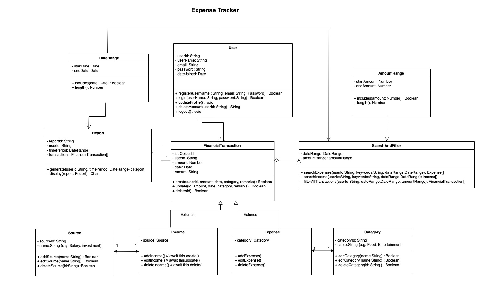

# final-project-group
**ExpenseTracker:**
ExpenseTracker is a comprehensive website designed to help individuals manage their personal finances with ease and precision. The core functionality of this platform lies in its ability to allow users to meticulously log their daily expenses. Each entry can include critical details such as the amount spent, the date of the transaction, the category of expenditure (like food, entertainment, utilities), and any additional remarks for context.

## Team Members
- Yiyang Zhang - 002699350
- Chenxu Zhang - 002190050
- Yidan Wang - 002610125
- Shuangge Li - 002704480

## Technical Stack
- Front-end：Next.js
- Back-end：Node.js
- Database：MongoDB

## Milestones for the Project

### Milestone 1 : Due by 11/14, 2023
requirements and design

1. Finalize Project Topic and technology stack
2. Design features and Object Model

### Milestone 2 : Due by 11/21, 2023
login and setup

1. Implement Rest Apis and set up the Database.
2. Implement authentication system and user registration including the front-end.
3. Complete the main feature where the users can add, edit and delete transaction informations.
4. User profile implementation with all sub-features.

### Milestone 3 : Due by 11/28, 2023
reports and display charts

1. Implement Monthly/Yearly Reports Generation Feature.
2. Develop a Dynamic Chart Display Feature.
3. Build the Front-end for Viewing Reports and Charts.

### Milestone 4 :: Due by 12/5, 2023
search and optimization

1. Create Search Functionality for Transaction Details and Reports.
2. Optimize the Application for Performance and User Experience.
3. Final Testing and Documentation of Features.

## User Stories Under Each Milestone

### Milestone 1 :: requirements and design

User stories
Title                                           -  Assignee
1. Design Object Model                          -  Yidan Wang
2. Create and document resources                -  Yiyang Zhang
3. OpenApi Specification and documentation      -  Shuangge Li
4. Rest Api Design for main CRUD feature        -  Chenxu Zhang 
5. Rest api design for create,update and delete expense and income    -  Yidan Wang
6. Rest api design for displaying charts        -  Yiyang Zhang
7. Implement users get/post/put/delete Rest API -  Shuangge Li
8. Create milestones and readme update          -  Yidan Wang
9. Draw Domain driven design on draw.io         -  Chenxu Zhang 
10. Create user stories                         -  Yiyang Zhang
11. Determine final project topic and stack     -  Shuangge Li
12. Feasibility check, project scope and tech stack - Chenxu Zhang 
13. Readme update for user stories              -  Yiyang Zhang
14. Fix object model based on TA suggestions    -  Yidan Wang
15. Brainstorm on extra features                -  Chenxu Zhang 
16. Creating the OpenAPI Specification Yaml     -  Shuangge Li

### Milestone 2 :: login and setup

User stories
Title                                           - Assignee
1. Basic node project setup                     -  Chenxu Zhang 
2. Basic Database setup                         -  Shuangge Li
3. Setting up the environment and installation for React/Redux(RTK) - Yiyang Zhang
4. Design wireframe and develop front-end for Login feature - Yidan Wang
5. Design wireframe and develop front-end main feature - Chenxu Zhang 
6. Design wireframe and front-end for user profile - Yiyang Zhang
7. Implement Rest Apis for user authentication/login  -  Shuangge Li
8. Implement functionalities for adding, editing and deleting transaction informations - Yidan Wang
9. State management for Login feature and User profile - Chenxu Zhang 
10. TDD(Test driven development) Unit testing for login feature - Shuangge Li
11. TDD Unit testing for User profile            - Yiyang Zhang
12. TDD Unit Testing for main feature            - Yidan Wang
13. Implement Rest Apis for User profile         - Chenxu Zhang 
14. Implement Rest Apis for transaction feature  - Shuangge Li
15. Verify and test all requests on Postman      - Yiyang Zhang
16. Code documentation and code quality          - Yidan Wang
17. Implement services for User Profile          - Chenxu Zhang 
18. Implement services for login feature         - Shuangge Li
19. CSS(Sass) styling for login                  - Yiyang Zhang
20. CSS styling for user profile                 - Yidan Wang
21. Git flow and source configuration            - Chenxu Zhang 
22. DB management and admin for User profile     - Shuangge Li

### Milestone 3 :: reports and display charts

User stories
Title                                                - Assignee
1. Develop front-end for Reports Generation feature  - Chenxu Zhang 
2. State management for Reports Generation feature   - Chenxu Zhang 
3. Verify and test all endpoints POSTMAN             - Shuangge Li
4. Test Driven Development (TDD) Reports Generation feature - Yiyang Zhang
5. Build Rest Api for Reports Generation feature     - Yidan Wang
6. Design UI and Wireframe for Reports Generation    - Chenxu Zhang 
7. Develop backend services for Reports Generation   - Shuangge Li
8. Update Mongodb for Reports Generation             - Yiyang Zhang
9. Test endpoints on Postman for displaying charts   - Yidan Wang
10. Develop frontend for displaying charts           - Yiyang Zhang
11. Test Driven Development displaying charts        - Yidan Wang
12. State management for displaying charts           - Chenxu Zhang 
13. Design UI and wireframe for charts               - Shuangge Li
14. Build REST Api rest for displaying charts        - Yiyang Zhang
15. Develop backend services for displaying charts   - Yidan Wang

### Milestone 4 :: search and optimization

User stories
Title                                                - Assignee
1. Build Rest Api for search feature                 - Chenxu Zhang 
2. Design UI and wireframe for search feature        - Yiyang Zhang
3. State management for search                       - Yidan Wang
4. Implement search by category for more queries     - Shuangge Li
5. Develop backend services for search feature       - Chenxu Zhang 
6. Test Driven Development for search feature        - Yiyang Zhang
7. Verify and test all endpoints Postman for search  - Yidan Wang
8. Prepare detailed documentation for the application  - Shuangge Li
9. Review and optimize codebase for performance best practices  - Chenxu Zhang 
10. Update the Application GitHub ReadMe             - Yidan Wang
11. Code reviews and enhancements                    - Shuangge Li
12. Project Video editing and development            - Yiyang Zhang

# Object Model

# REST API resources required for the project user stories

The ExpenseTracker application provides a comprehensive suite of APIs that facilitate the creation, retrieval, updating, and deletion of user data and financial transactions in an intuitive and secure manner.

## Users Resource (/users and /users/{userId})

- POST /users: Register a new user with a username, password, email, and phone.
- GET /users/{userId}: Retrieve information for a user identified by userId.
- PUT /users/{userId}: Update the information for the user identified by userId.
- DELETE /users/{userId}: Delete the user identified by userId.

## Authentication Resource (/login)

- POST /login: Authenticate a user with a username and password to log in.

## Transaction Resource 
- POST /transactions: Add a new transaction with type, amount, date, and an optional comment.
- PUT /transactions/{transactionId}: Update a record identified by transactionId.
- DELETE /transactions/{transactionId}: Delete a record identified by transactionId.
- GET /transactions/{transactionId}: Get a transaction by its ID
- GET /transactions/{userId} : Retrieves all transactions for a specified user.

## Source Resource (/sources and /sources/{sourceId})
- POST /sources: Add a new income source record with a name attribute.
- GET /sources/userId: Retrieve all income source records for a specific user.
- PUT /sources/{sourceId}: Update an income source record identified by sourceId with a new name.
- DELETE /sources/{sourceId}: Delete an income source record identified by sourceId.

## Category Resource (/categories and /categories/{categoryId})
- POST /categories: Add a new expense category record with a name attribute.
- GET /users/{userId}/sources: Retrieve all expense source records for a specific user.
- PUT /categories/{categoryId}: Update an expense category record identified by categoryId with a new name.
- DELETE /categories/{categoryId}: Delete an expense category record identified by categoryId.

## Reports Resource (/report and /report/{userId})

- GET /report: Generate consumption reports based on provided start and (optionally) end dates.
- POST /report/{userId}: Create a chart-based financial report for a user over a specified time period, including transactions.

## User Records Query Resource (/queries)

- GET /queries: Query all user records with optional filters like record type, date range, expense type, income type, and amount range.

### Error Schemas

- ErrorLogin, ErrorUsername, ErrorPassword: Define the structure of the error responses for various operations that could fail due to user input or system states.

# hw9 update
## User rest api
POST
http://localhost:3000/users
Body:json
{
"name": "pikachu",
"password": "secret",
"email": "pikachu@gmail.com",
"phone": "2861346688"
}

GET
http://localhost:3000/users?_id=6558e803acf07c7d1ee4da47

PUT
http://localhost:3000/users/6558e803acf07c7d1ee4da47
Body:json
{
"name": "pikachuPokemon",
"password": "newSecret",
"email": "pikachuPokemon@gmail.com",
"phone": "2521345500"
}

DELETE
http://localhost:3000/users/6558e803acf07c7d1ee4da47
